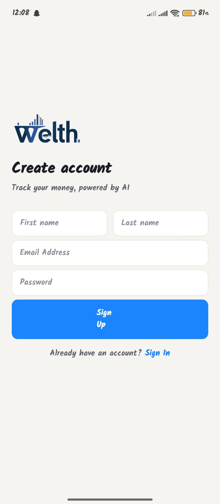
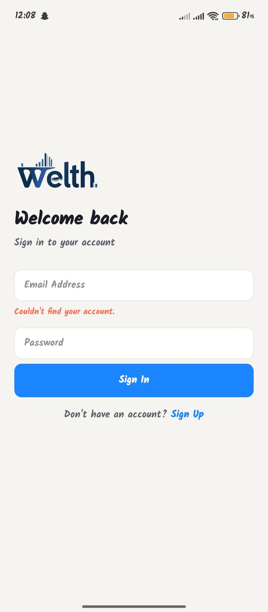
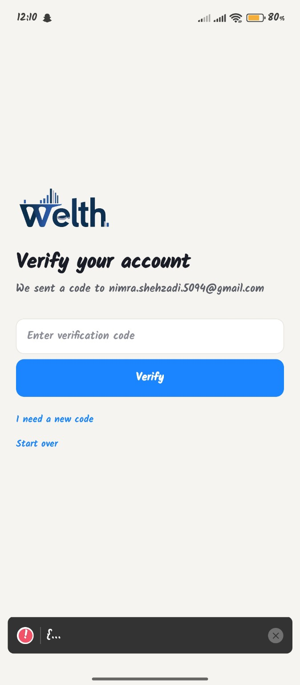

# Progress Report — 22 August 2026

## Work Completed

- Implemented the Welth app authentication flow using Clerk.
- Created the Sign Up screen.
- Created the Sign In screen.
- Added OTP verification for account verification.
- Tested account creation and authentication flow on the mobile device.
- Added authentication-based navigation and routing.
- Introduced RabbitMQ for the project.
- Created the initial account setup and authentication structure.

## Screens Completed

- Sign Up / Create Account
- Sign In
- OTP Verification

## Status

Authentication flow is implemented and tested on the mobile device.

## Authentication Screens

### Create Account

### Sign In

### OTP Verification

