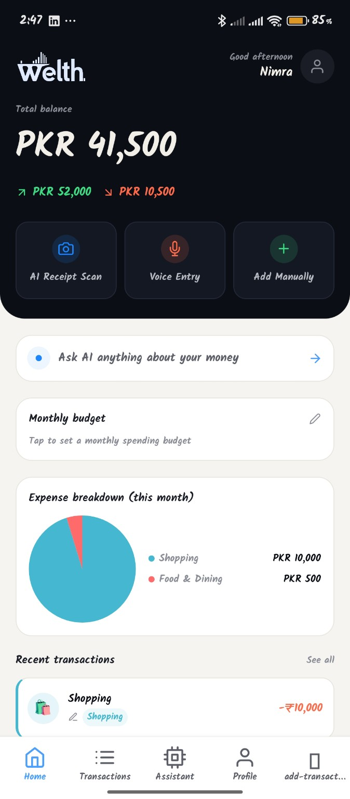
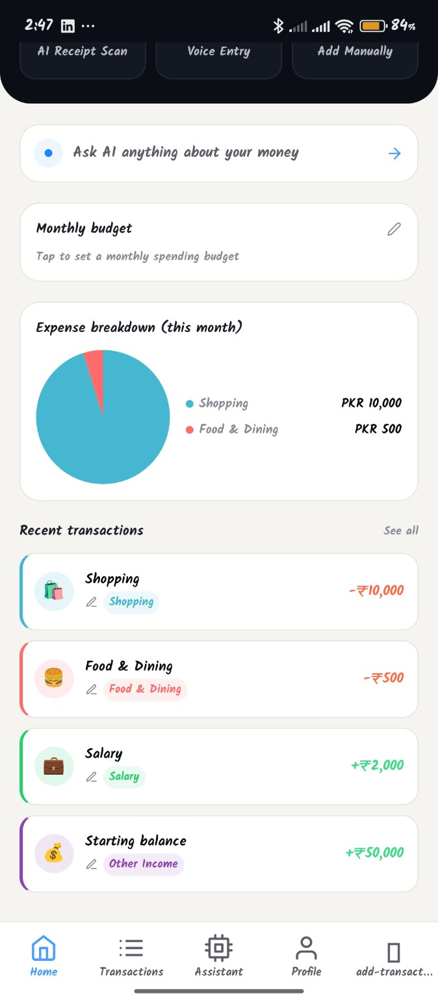
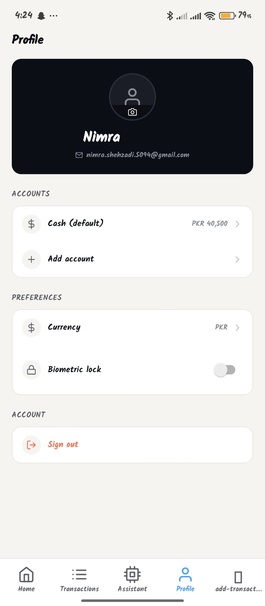

# **26-Aug-2026 Progress**

## **Completed Today**

- Fixed project structure and import paths.
- Worked on the AI Assistant feature.
- Configured Supabase Edge Functions.
- Tested the Expo app on mobile using Tunnel mode.
- Identified and fixed module/import errors.
- Updated the project README with features, tech stack, and setup instructions.

## **App Screenshots**

  
  
  
  
  

## **Current Status**

The Welth React Native finance app is progressing well, with the main features and backend services being integrated and tested.

## **Next Steps**

- Test all features on mobile.
- Fix any remaining errors.
- Finalize UI and functionality.
- Complete final testing and deployment.
